# 📊 Chuẩn hóa Screen Flow Diagram cho MT-GRMS

Dựa vào sơ đồ Screen Flow (PlantUML) hiện tại của dự án và đối chiếu với **Kiến trúc hệ thống KiotViet** (đã crawl ở bước trước), mình nhận thấy flow hiện tại đã bám rất sát 26 tính năng WBS. Tuy nhiên, nếu xét trên **trải nghiệm người dùng thực tế (UX) của thị trường bán lẻ**, hệ thống đang có một số điểm "ngược logic" và **thiếu hụt** một vài màn hình tối quan trọng.

---

## 1. Phân tích các điểm cần tối ưu (Gaps & UX Issues)

### 🔴 1. Thiếu màn hình Quản lý Hóa đơn & Trả hàng (Invoices & Returns)
- **Vấn đề:** Hiện tại có `Quầy POS (SCR12)` để bán, nhưng **không có màn hình để xem lại Lịch sử bán hàng** hoặc **Xử lý Trả hàng** (khi khách mang hàng ra đổi trả).
- **Thực tiễn (KiotViet):** KiotViet có menu "Giao dịch" chứa Hóa đơn và Trả hàng.
- **Giải pháp:** Cần bổ sung màn hình **"Lịch sử Hóa đơn & Trả hàng"** (Tra cứu hóa đơn, in lại bill, hoàn tiền VietQR).

### 🟠 2. Vị trí của "Nhà cung cấp" (Suppliers) bị sai lệch
- **Vấn đề:** Đang được đặt dưới `Cấu hình (SCR28) -> Nhà cung cấp (SCR19)`. Điều này rất vô lý với người dùng vì NCC là thực thể giao dịch, không phải là cấu hình hệ thống.
- **Giải pháp:** Nên gộp chung Khách hàng (SCR17) và Nhà cung cấp (SCR19) thành một nhóm menu là **"Đối tác" (Partners)**; HOẶC đặt Nhà cung cấp đi liền với nhánh **"Đơn nhập hàng PO" (SCR11)**.

### 🟡 3. "Sổ Quỹ" nằm sai nhóm
- **Vấn đề:** Sổ quỹ (SCR21) đang nằm dưới `Báo cáo & KPI (SCR20)`. Tuy nhiên, Sổ quỹ là nơi **thao tác nghiệp vụ** (Lập phiếu thu/chi hằng ngày), không phải là báo cáo tĩnh.
- **Giải pháp:** Tách menu **"Tài chính" (Finance)** chứa Sổ quỹ (SCR21) và Chi phí dịch vụ (SCR31) ra khỏi nhóm Báo cáo.

### 🟢 4. Thiếu Thiết lập Cửa hàng cơ bản
- **Vấn đề:** Menu `Cấu hình (SCR28)` chỉ đang trỏ tới RBAC và Đối tác giao hàng. Thiếu nơi để chủ shop cấu hình tên cửa hàng, địa chỉ in trên bill, tài khoản VietQR mặc định.
- **Giải pháp:** Thêm màn hình **"Thiết lập Cửa hàng & Bill"** vào menu Cấu hình.

---

## 2. Đề xuất PlantUML Mới (Đã chuẩn hóa)

Dưới đây là đoạn mã PlantUML đã được sắp xếp lại logic luồng đi (Routing) cho chuẩn xác nhất với nghiệp vụ:

```plantuml
@startuml

skinparam state {
    FontSize 11
    FontName Arial
    BorderColor #999999
    ArrowColor #666666
}
skinparam Shadowing false

' --- PUBLIC WEB STORE ---
state "Mini Web Store (Home)" as SCR32 #C5E1A5
state "Product Detail" as SCR33 #C5E1A5
state "Cart & Checkout" as SCR34 #C5E1A5
state "Order Tracking" as SCR34T #C5E1A5

' --- AUTH ---
state "Login" as SCR01 #FFF9C4
state "Forgot Password" as SCR02 #FFF9C4
state "First-Time Password Change" as SCR03 #FFF9C4
state "2FA Authentication" as SCR01a #FFF9C4

' --- DASHBOARD ---
state "Post-Login" as POST #FFFFFF
state "Owner Dashboard" as SCR04 #E1BEE7
state "Master Admin Dashboard" as SCR35 #E1BEE7

' --- MENU CHINH ---
state "Product Management" as SCR05 #FFCCBC
state "Transactions & POS" as SCR_TRANS #FFCCBC
state "Inventory & Purchasing" as SCR_INV #FFCCBC
state "Partners" as SCR_PARTNER #FFCCBC
state "Finance & Cashbook" as SCR_FINANCE #FFCCBC
state "Reports & KPI" as SCR20 #FFCCBC
state "HR Management" as SCR25 #FFCCBC
state "System Configuration" as SCR28 #FFCCBC

' --- MAN HINH CHI TIET ---
state "Product Catalog" as SCR06 #FFF9C4
state "Price Books" as SCR07 #FFF9C4
state "Promotions & Vouchers" as SCR16 #FFF9C4

state "POS Checkout" as SCR12 #FFF9C4
state "Invoices & Returns" as SCR_INVOICE #FFF9C4
state "Pre-orders" as SCR15 #FFF9C4
state "Shift Management" as SCR14 #FFF9C4
state "VietQR Payment" as SCR13 #FFF9C4
state "AI Recommender" as SCRAI #FFE0B2

state "Inventory & FEFO" as SCR09 #FFF9C4
state "Purchase Orders (PO)" as SCR11 #FFF9C4
state "Stocktaking" as SCR10 #FFF9C4
state "Inter-Branch Transfer" as SCR22 #FFF9C4
state "Internal Use & Wastage" as SCR23 #FFF9C4

state "Customer CRM" as SCR17 #FFF9C4
state "Suppliers" as SCR19 #FFF9C4
state "Accounts Receivable (AR)" as SCR18 #FFF9C4
state "Accounts Payable (AP)" as SCR24 #FFE0B2

state "Cashbook Ledger" as SCR21 #FFF9C4
state "Service Expenses" as SCR31 #FFF9C4

state "Work Schedules" as SCR26 #FFF9C4
state "Attendance & Payroll" as SCR27 #FFF9C4

state "Store & Bill Settings" as SCR_STORE #FFF9C4
state "Roles & Permissions (RBAC)" as SCR29 #FFF9C4
state "Delivery Partners" as SCR20D #FFF9C4
state "Tax & E-Invoices" as SCR30 #FFF9C4

' --- SAAS ADMIN ---
state "Tenant Management" as SCR36 #B3E5FC
state "SaaS Subscriptions" as SCR37 #B3E5FC
state "Soft / Hard Lock" as SCR38 #B3E5FC

' --- ROUTING LOGIC ---
SCR32 --> SCR33
SCR33 --> SCR34
SCR34 --> SCR34T

SCR01 --> SCR02
SCR01 --> SCR01a
SCR01 --> SCR03
SCR01a --> POST
SCR03 --> POST
SCR01 --> POST

POST --> SCR04
POST --> SCR35

SCR04 --> SCR05
SCR04 --> SCR_TRANS
SCR04 --> SCR_INV
SCR04 --> SCR_PARTNER
SCR04 --> SCR_FINANCE
SCR04 --> SCR20
SCR04 --> SCR25
SCR04 --> SCR28
SCR04 --> SCR32

' SP
SCR05 --> SCR06
SCR05 --> SCR07
SCR05 --> SCR16

' Giao dich
SCR_TRANS --> SCR12
SCR_TRANS --> SCR_INVOICE
SCR_TRANS --> SCR15
SCR12 --> SCR13
SCR12 --> SCR14
SCR12 --> SCRAI

' Kho
SCR_INV --> SCR09
SCR_INV --> SCR11
SCR_INV --> SCR10
SCR_INV --> SCR22
SCR_INV --> SCR23

' Doi tac
SCR_PARTNER --> SCR17
SCR_PARTNER --> SCR19
SCR17 --> SCR18
SCR19 --> SCR24

' Tai chinh
SCR_FINANCE --> SCR21
SCR_FINANCE --> SCR31

' Nhan su
SCR25 --> SCR26
SCR25 --> SCR27

' Cau hinh
SCR28 --> SCR_STORE
SCR28 --> SCR29
SCR28 --> SCR20D
SCR28 --> SCR30

' Master Admin
SCR35 --> SCR36
SCR35 --> SCR37
SCR35 --> SCR38

@enduml
```

### 🎯 Tóm tắt các thay đổi:
1. Tạo menu cấp 1 **`Giao dịch & POS`**: Chứa POS, Lịch sử Hóa đơn/Trả hàng, và Đơn đặt trước.
2. Tạo menu cấp 1 **`Kho & Nhập hàng`**: Gộp chung Tồn kho, Lô hàng, Kiểm kho, PO và Xuất hủy vào một chỗ.
3. Tạo menu cấp 1 **`Đối tác`**: Kéo Nhà cung cấp từ Cấu hình sang đứng cạnh Khách hàng. Từ Khách hàng link sang Công nợ AR, từ NCC link sang Công nợ AP.
4. Tạo menu cấp 1 **`Tài chính & Sổ quỹ`**: Rút Sổ quỹ và Chi phí dịch vụ ra khỏi Báo cáo.
5. Thêm **`Thiết lập Cửa hàng`** và **`Thuế & Hóa đơn điện tử`** vào nhóm Cấu hình hệ thống.
