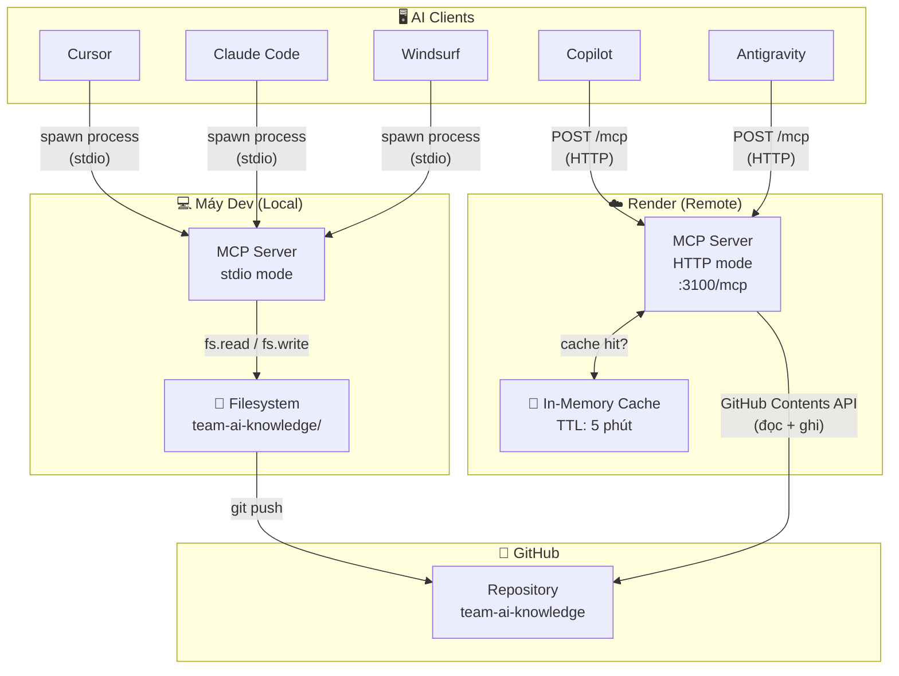
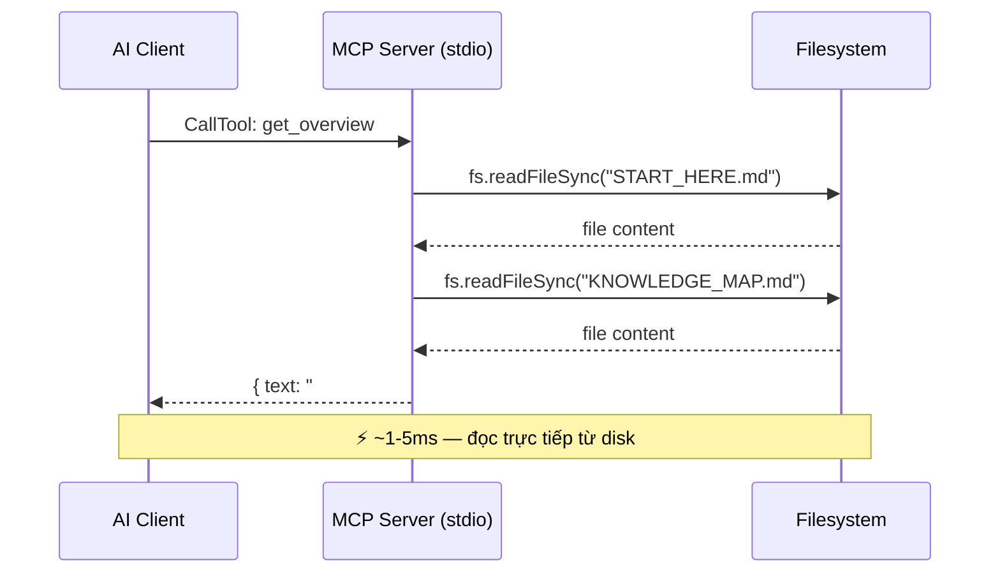
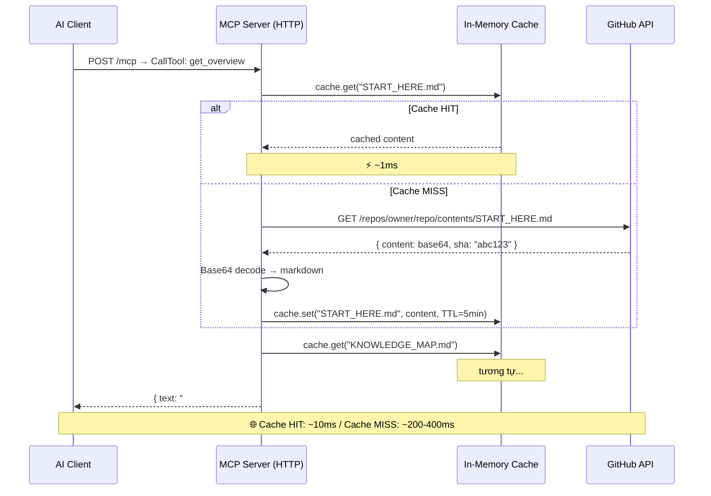
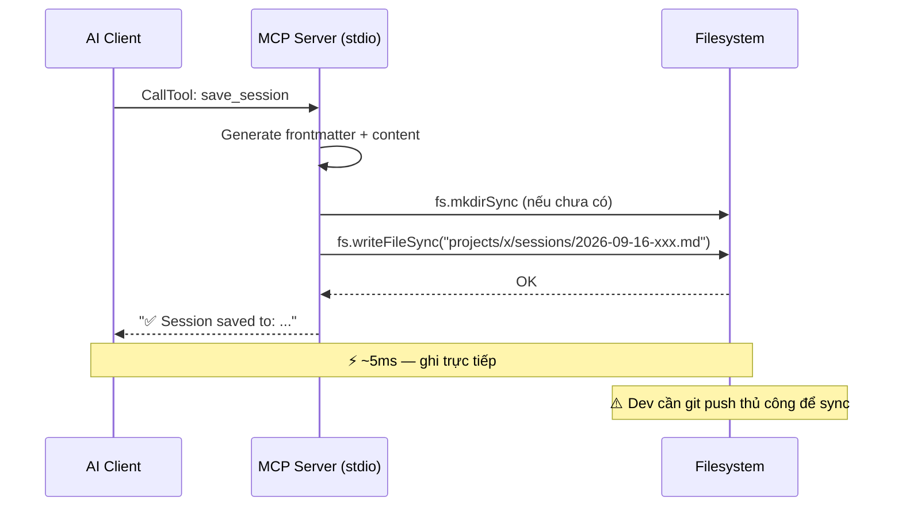
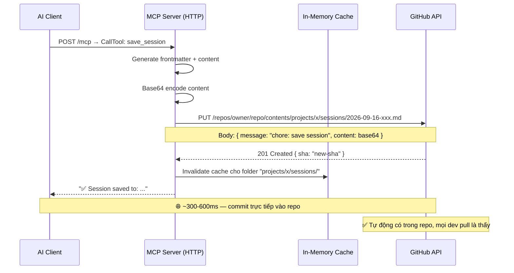
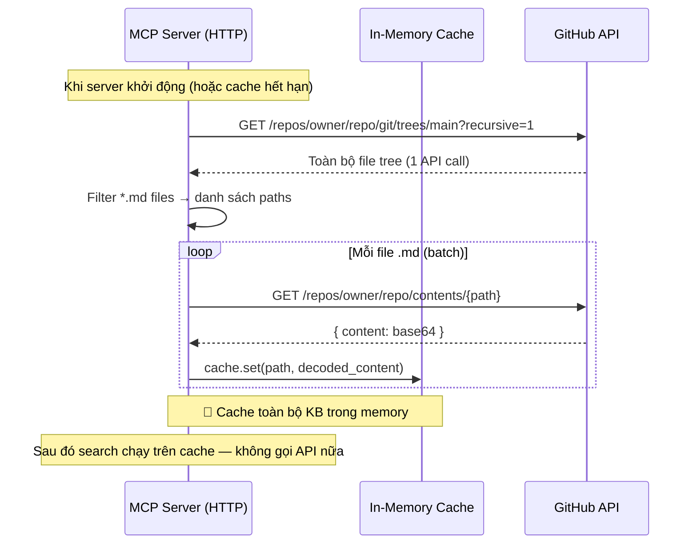
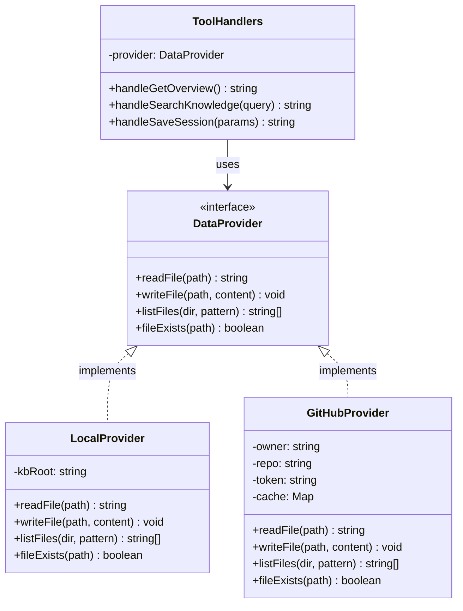
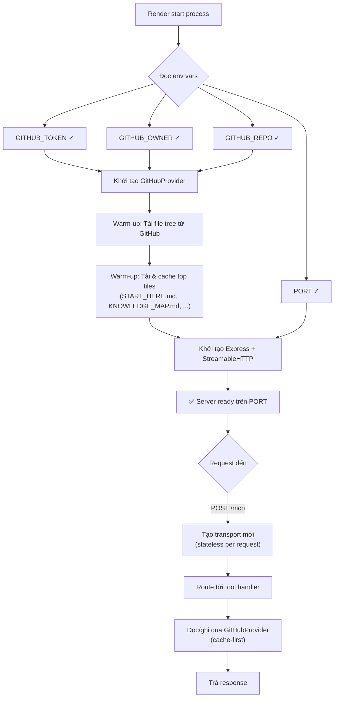

# Mô Hình Luồng Hoạt Động — MCP Server Dual-Mode

## 1. Kiến trúc tổng quan



---

## 2. Luồng ĐỌC dữ liệu (get_overview, search_knowledge, ...)

### Mode A: Local (stdio)



### Mode B: Remote (HTTP trên Render)



---

## 3. Luồng GHI dữ liệu (save_session, save_lesson)

### Mode A: Local (stdio)



### Mode B: Remote (HTTP trên Render)



---

## 4. Luồng SEARCH (search_knowledge)

### Vấn đề chính ở Remote mode

Search cần duyệt **tất cả file .md** → trên GitHub sẽ rất tốn API calls nếu không có cache.



### Caching Strategy

```
┌─────────────────────────────────────────────────┐
│              In-Memory Cache                     │
│                                                  │
│  fileTree     │ TTL: 10 phút │ Danh sách files  │
│  fileContent  │ TTL: 5 phút  │ Nội dung từng file│
│  searchIndex  │ TTL: 5 phút  │ Index đã build    │
│                                                  │
│  Invalidate khi: save_session / save_lesson      │
│  Warm-up khi: server khởi động                   │
└─────────────────────────────────────────────────┘
```

---

## 5. Data Provider — Code Architecture



---

## 6. Luồng khởi động trên Render



---

## 7. Tổng kết hiệu năng

| Thao tác | Local (stdio) | Remote (cache HIT) | Remote (cache MISS) |
|----------|:------------:|:------------------:|:-------------------:|
| `get_overview` | ~3ms | ~10ms | ~400ms |
| `search_knowledge` | ~50ms | ~20ms | ~2-3s (lần đầu) |
| `save_session` | ~5ms | — | ~500ms |
| `save_lesson` | ~5ms | — | ~500ms |
| `list_recent_sessions` | ~30ms | ~15ms | ~1s |

> [!NOTE]
> Sau warm-up, hầu hết requests sẽ hit cache → hiệu năng remote gần bằng local.

---

## 8. Env Variables cần thiết trên Render

| Variable | Mô tả | Ví dụ |
|----------|--------|-------|
| `PORT` | Render tự set | `10000` |
| `GITHUB_TOKEN` | Fine-grained PAT (repo content read/write) | `github_pat_xxx` |
| `GITHUB_OWNER` | GitHub username hoặc org | `your-username` |
| `GITHUB_REPO` | Tên repository | `team-ai-knowledge` |
| `GITHUB_BRANCH` | Branch đọc/ghi (default: main) | `main` |
